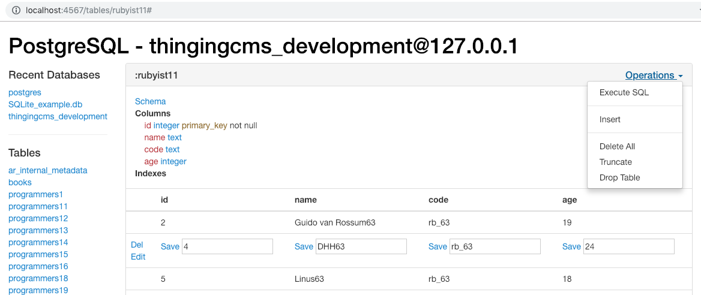

## Ruby Database Admin
A gem based on [Sinatra](https://github.com/sinatra/sinatra) and [Sequel](https://github.com/jeremyevans/sequel).
You can use it to manage multiple databases at the same time.

For Rails user, this gem will treat `./config/database.yml` as database configuration file.

Here are some demo pictures.

## Installation
~~~ruby
gem install db_admin
~~~
If you prefer to use it in `Gemfile`:
~~~ruby
group :development do
  # A Web UI for database admin. Run `$ db_admin` and then
  # visit http://localhost:4567
  gem 'db_admin', require: false # You needn't to require the code.
end
~~~

Make sure you have installed database driver gem.

E.g: `gem install pg`, `gem install sqlite3` or `gem install mysql2`, etc. Then

~~~bash
$ db_admin # Run this command to start a Sinatra Web.
~~~
Visit [http://localhost:4567](http://localhost:4567/)

### Connect to database
There are two ways for you to connect to a database.

1) Visit [http://localhost:4567](http://localhost:4567/) . The homepage will ask you to connect to a database. Please look at the demo picture above.

2) `touch ./config/database.yml` or `touch ./database.yml`

You can use Rails's `database.yml` file directly.

In `database.yml`, 'Omit the key' or 'keep the value blank' means use the default value.
~~~yaml
# 'database.yml' for Rails style example 1. We only connect to the 'development' database!
development:
  adapter: postgresql
  encoding: unicode
  host: localhost
  database: something_development
  username: username
  password:
  port: 5432
~~~
~~~yaml
# 'database.yml' for Rails style example 2. Inherited style is also supported.
default: &default
  adapter: postgresql
  # Below omitted ...

development:
  <<: *default
  database: something_development
  # Below omitted ...
~~~
~~~yaml
# 'database.yml' for none-Rails style example.
adapter: postgres
encoding: unicode
host: localhost
database: your_database_name
user: username
password:
port: 5432
~~~

## Customizing
If you want to change some code for your own purpose, please
~~~bash
$ git clone git@github.com:gazeldx/db_admin.git
$ cd db_admin
$ ruby lib/db_admin/run_web.rb # Then visit http://localhost:4567 
~~~

### Debugging
You need to restart Web when you made a change. 

Uncomment the below line in `./lib/db_admin.rb` to auto-reload changed files.
~~~ruby
require 'sinatra/reloader' if development? # `$ gem install sinatra-reloader` first. 
~~~
