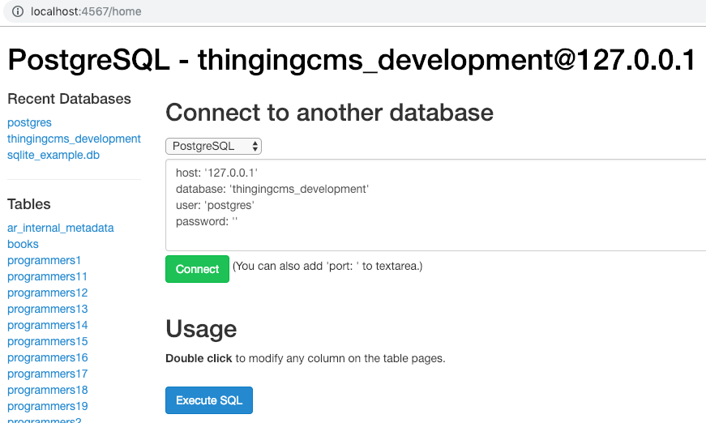
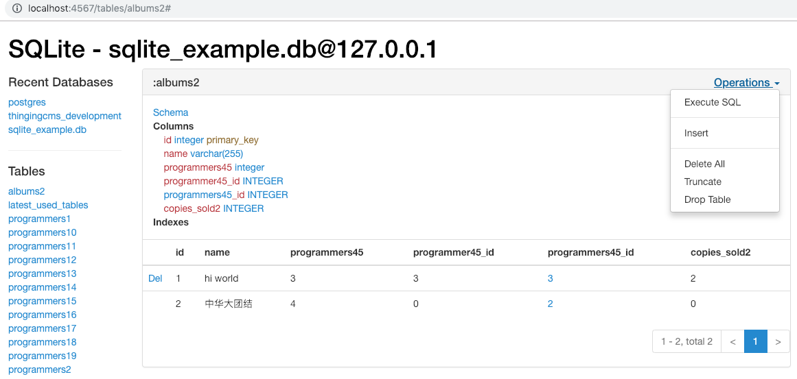
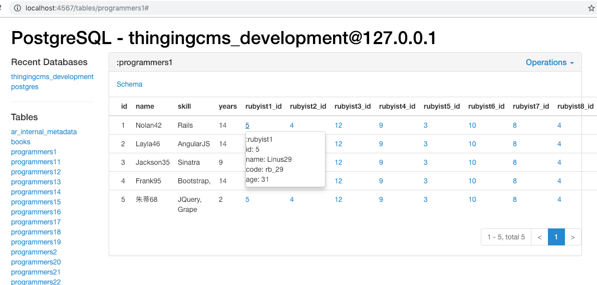

## Ruby Database Admin
A Sequel and Sinatra project.

Demo picture below. You can use it to manager multiple databases at the same time.

## Installation
~~~bash
$ git clone git@github.com:gazeldx/ruby-db-admin.git
$ cd ruby-db-admin
~~~

Read [Gemfile](./Gemfile) to install your database driver gem. Then
~~~bash
$ bundle install
$ ruby db_admin.rb # Run the Sinatra Web App. You can also run it as daemon: `$ nohup ruby db_admin.rb &`
~~~
Visit [http://localhost:4567](http://localhost:4567/)

## Contributing

Improving ruby-db-admin, please clone and pull requests! We love you do it.

## License

[MIT license](http://www.opensource.org/licenses/MIT).

TODOs at [WIKI](https://github.com/gazeldx/ruby-db-admin/wiki).