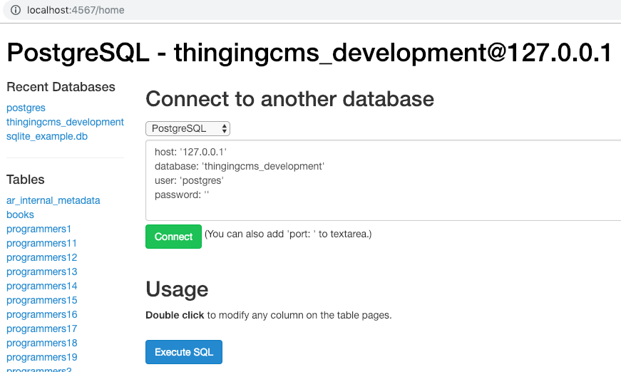
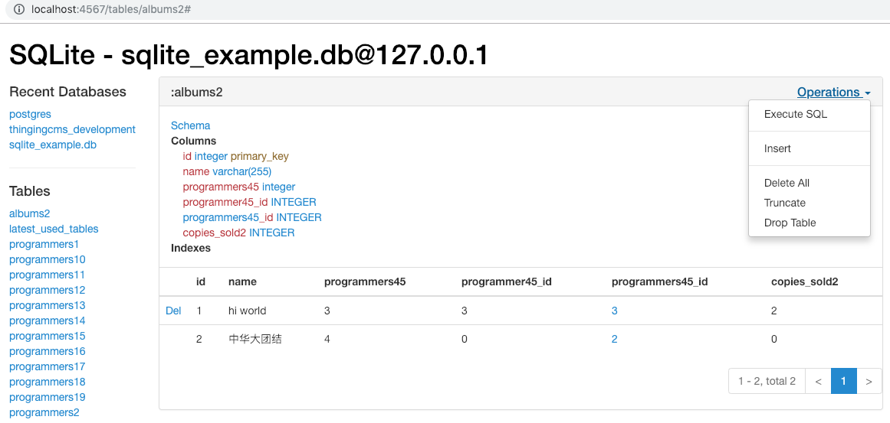
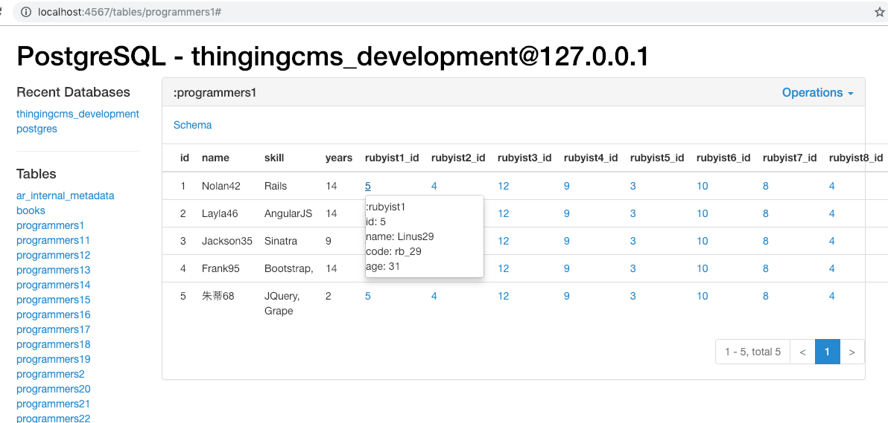

## Ruby Database Admin
A Sequel and Sinatra project.

You can use it to manage multiple databases at the same time.

Here are some Demo pictures.

## Installation
~~~bash
$ gem install db_admin
~~~
Or add `gem 'db_admin'` to `Gemfile` and run `$ bundle install`.

Make sure you have installed database driver gem. E.g: in `Gemfile`
~~~ruby
gem 'sqlite3' # SQLite
gem 'pg' # PostgreSQL
gem 'mysql2' # MySQL
~~~

~~~bash
$ db_admin # Run this command will start a sinatra Web.
~~~
Visit [http://localhost:4567](http://localhost:4567/)

## Contributing
Improving ruby-db-admin, please clone and pull requests! We love you do it.
